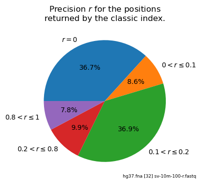

# 🧬 accel-align-rmi

A version of [Accel-Align](https://github.com/raja-appuswamy/accel-align-release) using the RMI index.

**_See also the [original README](./README_og.md)._**

## 0 | Init
### 🐑 Clone the repository
The repository can be cloned by running:
```sh
git clone --recursive https://github.com/IlariaPilo/accel-align-rmi
```

### ⏬ Download a reference string【 optional 】
The script [`/data/download.sh`](./data/download.sh) can be used to download and post-process a reference string. The downloaded string is called `hg37.fna`, and it is saved in the current working directory.

## 1 | Setup
### 🐋 Run in Docker【 recommended 】
To run the program inside a container, run the following commands:
```sh
cd docker
bash build.sh
bash run.sh <data_directory>
```
where `<data_directory>` is the directory storing the reference genome and the reads.

Inside the container, the content of `<data_directory>` can be found in the `/home/accel-align-rmi/genome/` folder.

<!--## 🗺️ Configure the TBB path-->
### 🌊 Install TBB
Accel-Align-RMI requires [TBB 20](https://github.com/oneapi-src/oneTBB/releases/tag/v2020.3). If you want to run the aligner outside the container, it is necessary to build the library from sources. It can be done as follows:
```bash
curl -LJO https://github.com/oneapi-src/oneTBB/archive/refs/tags/v2020.3.tar.gz
tar -xzvf oneTBB-2020.3.tar.gz
rm oneTBB-2020.3.tar.gz
cd oneTBB-2020.3
make
cd build
chmod +x *.sh
sh generate_tbbvars.sh
sh tbbvars.sh
cd linux_intel64_gcc_*_release
sudo cp *.so /usr/lib
sudo cp *.so.2 /usr/lib
sudo /sbin/ldconfig
cd ../../include
sudo cp -rf ./* /usr/local/include
```
If you don't have `sudo` permissions, you can simply modify the value of the `TBB_INCLUDE` and `TBB_LIB` variables in the Makefile, setting them to the proper paths. For example:
```diff
- TBB_INCLUDE =	## your path here ##
- TBB_LIB =	## your path here ##
+ TBB_INCLUDE = /home/ilaria/oneTBB-2020.3/include
+ TBB_LIB = /home/ilaria/oneTBB-2020.3/build/linux_intel64_gcc_cc11_libc2.35_kernel5.15.0_release

```
## 2 | Build the index
### 🧠 RMI
The learned index must be built offline, before running the aligner. This can be done by using the [`index.sh`](./index.sh) script:
```sh
bash index.sh [OPTIONS] <reference.fna>
```
The script supports the following options:
```
  -t, --threads  THREADS  The number of threads to be used [all]
  -l, --len      LEN      The length of the kmer [32]
  -h, --help              Display this help message
```
It generates an output directory `<reference_string>_index<LEN>`, containing all index-related files, including:
- `keys_uintXX` and `pos_uint32` - two binary files storing keys and positions in the index, respectively. The first value in both files is a uint64 counter of the number of entries. Then, `keys_uintXX` contains pairs (uintXX key, uint32 cumulative_pos), where cumulative_pos is the sum of positions associated to a key lower than the current one. XX is equal to 32 if LEN <= 16 (meaning the kmer fits in 32 bits), to 64 otherwise. `pos_uint32` contains simply a list of uint32 positions.
- `optimizer.out` - the output of the RMI hyperparameter optimizer. It stores the 10 most promising architectures, as well as some statistics on their size and training time.
- `rmi_type.txt` - the architecture of the chosen RMI index.
- `<reference_string>_indexXX.so` and `<reference_string>_indexXX.sym` - the generated shared object for the index and the list of symbol names for the main functions. Notice that the list is necessary to avoid issues with different C++ standards.

### 🦘 Binary search index
The binary search index requires the same files as the RMI one (`keys_uintXX` and `pos_uint32`). If you already built an RMI index over a given reference, then there is no need to run anything. Otherwise, the `key_gen` program can be used to generate the files:
```sh
make key_gen
./key_gen [-l LEN] <reference.fna>
```

### 🏛 Classic hash table
Similarly, the classic Accel-Align hash table must be built before running the aligner. This can be done as:
```sh
make accindex
./accindex [OPTIONS] <reference.fa>
```
The following options are available:
```
  -t INT Number of cpu threads to use [all]
  -l INT Length of seed [32]
  -o Name of the output file 
  +-- index options [choose 1] --+
  |   -R Use RMI index           |
  |   -B Use binary index        |
  |   -H Use MOD hash table      |
  +------------------------------+
  -x Alignment-free mode
  -w Use WFA for extension. KSW used by default. 
  -p Maximum distance allowed between the paired-end reads [1000]
  -d Disable embedding, extend all candidates from seeding (this mode is super slow, only for benchmark).
  -m Seeding with minimizer.
  -s bisulfite sequencing read alignment mode 
```
where `prime = 1073741651` and `lprime = 2861333663`.

The program generates an index file named `<reference.fa>.hash<LEN>`. The file contains information about the MOD value and the XXH size used to generate it.

## 3 | 🔎 Call the aligner
The aligner can be built with `make accalign`, and then run as:
```sh
./accalign [OPTIONS] <reference.fa> <read.fastq>
```
The following options are available:
```
  -t INT Number of cpu threads to use [all]
  -l INT Length of seed [32]
  -o Name of the output file 
  -R Use RMI index 
  -x Alignment-free mode
  -w Use WFA for extension. KSW used by default. 
  -p Maximum distance allowed between the paired-end reads [1000]
  -d Disable embedding, extend all candidates from seeding (this mode is super slow, only for benchmark)
  -m Seeding with minimizer
  -s bisulfite sequencing read alignment mode
```
<!--⚠️ The original Accel-Align allows more options, which are not yet supported in the RMI version.-->

## 4 | 🎯 Compute the index precision
An alignment run will possibly benefit of the RMI index if the classic index precision is low. This mean that the index is returning positions which are actually associated with wrong seeds. 

To better analyze this behavior, the script [`stats.sh`](./stats.sh) can be used.
```sh
bash stats.sh [OPTIONS] <reference.fna> <read.fastq>
```
The following options are available:
```
  -l  INT  length of the kmer [32]
  -h  INT  value of hash MOD [2^29-1]
           special string values = 2^29-1, prime, lprime
  -x  INT  size of xxhash [0]
           values = 0 (xxh not used), 32, 64
```

where `prime = 1073741651` and `lprime = 2861333663`.

The script first generates the classic index `<reference.fna>.hash<LEN>`, and then computes its precision (that is, the ratio between correct positions and returned positions) using as seeds kmers coming from the `<read.fastq>` file. Results are saved in a `<read.fastq>.stats<LEN>` csv file.

It also processes the csv file, and it plots a histogram and a pie chart using the [`stats_analyzer.py`](./utilities/stats_analyzer.py) script.

<!---->

## 🛠️ Utility folder
The `utility` folder contains some useful helper scripts.

### 📊 benchmarks.sh
This [script](./utilities/benchmarks.sh) can be used to run automatic benchmarks comparing accel-align with/without learned index and averaging the results.
Programs should be already compiled, and indices should be built in advance, using the proper -l option.
```sh
bash benchmarks.sh [OPTIONS] <reference.fa> <read.fastq>
```
It supports the following options:
```
  -t, --threads  THREADS  The number of threads to be used [all]
  -e, --exec     EXEC     The number of times every program is called [10]
  -l, --len      LEN      The length of the kmer [32]
  -o, --output   DIR      The directory where to save the output files [accel-align-rmi]
  -h, --help              Display this help message
```
The script plots the average running times for the two versions. Details for each execution can be found in `<output>/accel_align_rmi<LEN>.out` and `<output>/accel_align_release<LEN>.out`. 

SAM results of the last execution are saved in `<output>/rmi<LEN>.sam` and `<output>/release<LEN>.sam`, respectively.

### 🔬 binary_visualizer.py
This [script](./utilities/binary_visualizer.sh) can be used to display the content of `keys_uint32`, `keys_uint64` or `pos_uint32` binary files in a human-readable format.

```sh
python3 binary_visualizer.py [OPTIONS] <filename>
```
It supports the following options:
```
  -n, --num_entries N   Number of entries to be displayed [10]
  -b, --backward        Read backward [off]
  -f, --forward         Read forward [on]
  -h, --help            Show this help message and exit
```

### 📜 evaluate_sam.py
This [script](./utilities/evaluate_sam.py) can be used to evaluate the results returned by the aligner.
```sh
python3 evaluate_sam.py <real-results.sam> <aligner-results.sam> [<aligner-name>]
```
It prints on the terminal a short report of the aligner performance. 
A more detailed, read-by-read analysis can be found in the `<aligner-results.csv>` file.